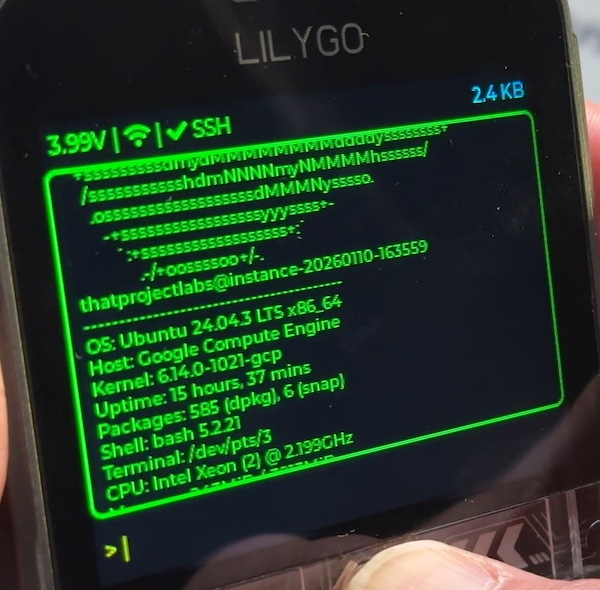

```
╔══════════════════════════════════════════════════════════════════════╗
║                                                                      ║
║   ██████╗  ██████╗  ██████╗██╗  ██╗███████╗████████╗                 ║
║   ██╔══██╗██╔═══██╗██╔════╝██║ ██╔╝██╔════╝╚══██╔══╝                 ║
║   ██████╔╝██║   ██║██║     █████╔╝ █████╗     ██║                    ║
║   ██╔═══╝ ██║   ██║██║     ██╔═██╗ ██╔══╝     ██║                    ║
║   ██║     ╚██████╔╝╚██████╗██║  ██╗███████╗   ██║                    ║
║   ╚═╝      ╚═════╝  ╚═════╝╚═╝  ╚═╝╚══════╝   ╚═╝                    ║
║                                                                      ║
║    ███████╗███████╗██╗  ██╗    ████████╗███████╗██████╗ ███╗   ███╗  ║
║    ██╔════╝██╔════╝██║  ██║    ╚══██╔══╝██╔════╝██╔══██╗████╗ ████║  ║
║    ███████╗███████╗███████║       ██║   █████╗  ██████╔╝██╔████╔██║  ║
║    ╚════██║╚════██║██╔══██║       ██║   ██╔══╝  ██╔══██╗██║╚██╔╝██║  ║
║    ███████║███████║██║  ██║       ██║   ███████╗██║  ██║██║ ╚═╝ ██║  ║
║    ╚══════╝╚══════╝╚═╝  ╚═╝       ╚═╝   ╚══════╝╚═╝  ╚═╝╚═╝     ╚═╝  ║
║                                                                      ║
╚══════════════════════════════════════════════════════════════════════╝
```

# PocketSSH

A portable SSH terminal client for the ESP32-S3 T-Deck Plus, featuring a hardware keyboard, trackball navigation, and touch gesture controls. Connect to remote servers, execute commands, and navigate your terminal with ease on this compact handheld device.



## Version History

### v1.2.0 (Faburary 1, 2026)
- **Added**: SSH public key authentication support
  - SD card SSH key management - automatically loads all `.pem` files from `/sdcard/ssh_keys/` on boot
  - Keys stored in memory for use with `sshkey` command
  - Terminal displays list of loaded keys at startup
  - Case-insensitive file extension matching (`.pem`, `.PEM`, etc.)
  - Supports multiple keys for different servers
  - SPI mode SD card access (compatible with T-Deck Plus hardware)
  - New syntax: `sshkey <HOST> <PORT> <USER> <KEYFILE>` (e.g., `sshkey 192.168.1.100 22 pi rpi_key.pem`)
  - Uses `libssh2_userauth_publickey_frommemory()` for in-memory key authentication
  - Supports PEM format RSA keys (generated with `ssh-keygen -m PEM`)
  - More secure alternative to password authentication
  - Displays available keys on error
- **Added**: Quote-aware argument parsing for WiFi credentials
  - Supports SSIDs and passwords with spaces using double quotes
  - Example: `connect "My WiFi Network" "my password"`
  - Works with mixed quoted/unquoted arguments
  - Backwards compatible with space-free credentials
- **Improved**: SSH authentication flexibility with two methods (password and public key)
- **Improved**: Enhanced logging for SD card operations (INFO level)
- **Fixed**: WiFi connection failures with networks containing spaces in SSID

### v1.1.0 (January 14, 2026)
- **Fixed**: Boot loop issue on quick power cycles caused by GPIO4 (strapping pin) ADC initialization
  - Added 100ms delay before ADC initialization to allow GPIO4 to settle after boot
  - Prevents residual voltage from interfering with boot strapping sequence
  - Device now boots reliably regardless of power cycle timing
- **Added**: Touch-to-position cursor functionality
  - Tap anywhere on input text to move cursor to that position
  - Improves text editing experience with precise cursor control
- **Improved**: System stability on rapid power on/off cycles

### v1.0.0 (Initial Release)
- Full SSH2 terminal with PTY support
- Hardware keyboard and trackball navigation
- Touch gesture controls
- Battery voltage monitoring
- Command history with NVS storage

## Key Features

### SSH Terminal
- Full SSH2 protocol support with password and public key authentication
- PTY terminal emulation (vt100) for proper shell interaction
- Real-time command execution and output display
- Handles large data transfers without freezing

### Hardware Controls
- **Physical Keyboard**: Full typing capability via C3 keyboard module
- **Trackball Navigation**: 
  - Up/Down: Navigate through command history
  - Click: Select/execute (when applicable)
- **Touch Screen Gestures**:
  - Swipe right-to-left: Show special keys panel
  - Swipe left-to-right: Hide special keys panel

### Special Keys Panel
Quick access to commonly used control sequences:
- **Ctrl+C**: Interrupt running process
- **Ctrl+Z**: Suspend process
- **Ctrl+D**: EOF signal / logout
- **Ctrl+L**: Clear screen
- **Tab**: Command completion
- **Esc**: Escape key
- **Exit SSH**: Close SSH session
- **Clear**: Clear terminal display

### Display Features
- 320x240 color LCD with LVGL graphics
- Real-time byte counter for data transfer monitoring
- Battery voltage indicator
- Connection status icons (WiFi, SSH)
- Non-blocking display updates prioritize rendering over input

## Hardware Requirements

- **ESP32-S3 T-Deck Plus**
  - ST7789 LCD Display (320x240)
  - GT911 Touch Controller
  - C3 Keyboard Module
  - Trackball (GPIO 1,2,3,15)
  - Battery monitoring (GPIO 4)

## Quick Start

### Prerequisites
- ESP-IDF v5.5.1
- ESP32-S3 T-Deck/T-Deck Plus

### First-Time Setup

1. **Connect to WiFi**:
   ```
   connect <SSID> <PASSWORD>
   ```
   Example: `connect MyNetwork MyPassword123`
   
   **For SSIDs or passwords with spaces**, use double quotes:
   ```
   connect "My WiFi Network" "my password 123"
   ```

2. **Connect to SSH Server**:
   
   **With Password**:
   ```
   ssh <HOST> <PORT> <USER> <PASSWORD>
   ```
   Example: `ssh 192.168.1.100 22 pi raspberry`
   
   **With Public Key**:
   ```
   sshkey <HOST> <PORT> <USER> <PRIVATE_KEY>
   ```
   Example: `sshkey 192.168.1.100 22 pi <paste_key_here>`

3. **Use Interactive Shell**:
   Once connected, any command you type is sent to the remote server:
   ```
   ls -la
   cd /home
   top
   vim myfile.txt
   ```

4. **Disconnect**:
   - Type `disconnect` command, or
   - Use Disconnect button in special keys panel

### Available Local Commands

These commands are executed locally on the device (not sent to SSH):
- `help` - Display available commands and usage
- `clear` - Clear the terminal display
- `disconnect` - Close WiFi connection
- `exit` - Close SSH connection
- `connect <SSID> <PASS>` - Connect to WiFi network (use quotes for spaces: `connect "My WiFi" password`)
- `ssh <HOST> <PORT> <USER> <PASS>` - Establish SSH connection (password auth)
- `sshkey <HOST> <PORT> <USER> <KEYFILE>` - Establish SSH connection (public key auth from SD card)

## SSH Key Setup Guide

PocketSSH supports SSH public key authentication using keys stored on SD card, eliminating the need to type long private keys on the hardware keyboard.

### Quick Start

**1. Generate SSH Key Pair**

On your computer, generate a PEM format RSA key:

```bash
ssh-keygen -t rsa -b 4096 -m PEM -f rpi_key -C "" -N ""
```

This creates two files:
- `rpi_key` - Private key (goes on SD card)
- `rpi_key.pub` - Public key (goes on server)

**2. Install Public Key on Server**

Copy the public key to your server's authorized_keys:

```bash
# Automatic method (if ssh-copy-id is available)
ssh-copy-id -i rpi_key.pub pi@raspberrypi.local

# Manual method
cat rpi_key.pub | ssh pi@raspberrypi.local 'mkdir -p ~/.ssh && cat >> ~/.ssh/authorized_keys'
```

**3. Copy Private Key to SD Card**

Create the directory structure on your SD card and copy the private key:

```bash
# Insert SD card and mount it (path may vary)
mkdir -p /Volumes/SDCARD/ssh_keys
cp rpi_key /Volumes/SDCARD/ssh_keys/rpi_key.pem
```

**Important**: The directory must be named exactly `ssh_keys` (lowercase) at the root of your SD card.

**4. Use on PocketSSH**

Insert the SD card into your T-Deck Plus and power on. The device will automatically load all `.pem` files from `/sdcard/ssh_keys/` and display them at startup.

Connect using the key filename:

```
wifi MyWiFi password123
sshkey 192.168.1.100 22 pi rpi_key.pem
```

### SD Card Directory Structure

```
/sdcard/
└── ssh_keys/
    ├── rpi_key.pem          ← Raspberry Pi
    ├── server1.pem          ← Production server
    ├── backup_server.pem    ← Backup server
    └── dev_machine.pem      ← Development box
```

### Key Management

**Multiple Keys**
- Load as many keys as you need
- Each server can have its own key
- Keys are identified by filename
- All keys loaded automatically on boot

**Supported Formats**
- File extension: `.pem` or `.PEM` (case-insensitive)
- Key type: RSA keys in PEM format only
- Passphrase: Not supported (use `-N ""` when generating)
- Max file size: 16KB per key

**Available Keys Display**
On startup, PocketSSH shows all loaded keys:
```
PocketSSH v1.3.0

Loaded SSH keys:
  - rpi_key.pem
  - server1.pem

Type 'help' for commands
>
```

If no keys are found:
```
No SSH keys found on SD card.
Place .pem files in /sdcard/ssh_keys/
```

**Error Handling**
If you reference a key that doesn't exist:
```
> sshkey 192.168.1.100 22 pi missing_key.pem
Error: SSH key 'missing_key.pem' not found.
Available keys:
  - rpi_key.pem
  - server1.pem
```

### Troubleshooting

**SD card not detected**
- Ensure SD card is FAT32 formatted
- Check SD card is properly inserted before powering on
- Look for "SD card mounted successfully" in startup logs

**Keys not loading**
- Verify directory is named `ssh_keys` (lowercase)
- Check file extension is `.pem` or `.PEM`
- Ensure files are valid PEM format RSA keys
- Check ESP-IDF Monitor logs for detailed error messages

**Authentication fails**
- Verify public key is in server's `~/.ssh/authorized_keys`
- Check file permissions: `chmod 600 ~/.ssh/authorized_keys`
- Ensure private key matches the public key on server
- Try password authentication first to verify credentials

### Advanced: Converting Existing Keys

If you have existing OpenSSH format keys, convert them to PEM:

```bash
# Convert OpenSSH private key to PEM format
ssh-keygen -p -m PEM -f ~/.ssh/id_rsa
```

**Warning**: This modifies your existing key file. Make a backup first:
```bash
cp ~/.ssh/id_rsa ~/.ssh/id_rsa.backup
```


## Architecture

### Framework & Libraries
- **ESP-IDF**: v5.5.1 - Official Espressif IoT Development Framework
- **LVGL**: v9.x - Graphics library with thread-safe display locking (`bsp_display_lock/unlock`)
- **libssh2**: SSH2 protocol implementation (see details below)
- **FreeRTOS**: Multi-task architecture for concurrent operations

### System Tasks
- **keypad_task**: Hardware keyboard input processing with non-blocking display updates
- **trackball_task**: Trackball GPIO monitoring for history navigation (0ms timeout, drops input if display busy)
- **ssh_receive_task**: SSH data reception and terminal output rendering
- **LVGL task**: GUI rendering and touch gesture detection

### Display Performance
- Non-blocking input system: `bsp_display_lock(0)` prioritizes screen rendering over input
- Buffered display updates prevent watchdog timeouts during large transfers
- Zero-timeout locks drop input gracefully when display is busy

## Using libssh2

PocketSSH uses **libssh2** for SSH2 protocol implementation, providing secure remote shell access.

### Integration
- **Library**: `skuodi__libssh2_esp` component from ESP Component Registry
- **Configuration**: Managed via `idf_component.yml` in the `main/` directory
- **Version**: Compatible with ESP-IDF v5.x

### Implementation Details

#### Connection Flow
```cpp
1. libssh2_session_init() - Initialize SSH session
2. libssh2_session_handshake() - Perform SSH handshake
3a. libssh2_userauth_password() - Authenticate with username/password
   OR
3b. libssh2_userauth_publickey_frommemory() - Authenticate with private key
4. libssh2_channel_open_session() - Open SSH channel
5. libssh2_channel_request_pty() - Request PTY for terminal emulation
6. libssh2_channel_shell() - Start shell session
```

#### Public Key Authentication

PocketSSH supports SSH public key authentication using keys loaded from SD card:

**Key Storage:**
- Keys loaded from `/sdcard/ssh_keys/` directory on boot
- Stored in memory using `std::map<std::string, std::string>`
- Referenced by filename in `sshkey` command

**Key Requirements:**
- **Format**: PEM format RSA keys (OpenSSH format not supported by mbedTLS)
- **File Extension**: `.pem` or `.PEM` (case-insensitive)
- **Passphrase**: Only passphrase-less keys supported
- **Max Size**: 16KB per key file

**Usage:**
```
sshkey 192.168.1.100 22 pi rpi_key.pem
```

**Implementation:**
- Uses `libssh2_userauth_publickey_frommemory()`
- Keys loaded via SPI SD card interface before LVGL initialization
- Memory-efficient: Keys stored as std::string in map container
- Automatic discovery: All `.pem` files loaded from `/sdcard/ssh_keys/`

**Security Benefits:**
- No password transmitted over network
- Keys can be easily revoked from server's authorized_keys
- Stronger cryptographic guarantees than passwords
- Immune to brute-force password attacks

See **SSH Key Setup Guide** section above for detailed setup instructions.

#### PTY Terminal Mode
- **Terminal Type**: vt100 emulation
- **PTY Size**: 80 columns × 24 rows (configurable)
- **Mode**: Provides proper terminal interaction with command prompts, colors, and cursor control

#### Data Handling
- **Non-blocking mode**: `libssh2_session_set_blocking(session, 0)`
- **Read buffer**: 4KB chunks processed by `ssh_receive_task`
- **Write operations**: Direct keyboard input → `libssh2_channel_write()`
- **Control sequences**: Special keys (Ctrl+C, Tab, etc.) sent as escape sequences

#### Security Features
- **Protocol**: SSH2 with encryption
- **Authentication**: 
  - Password-based (username/password)
  - Public key-based (RSA keys in PEM format)
- **Session**: Secure encrypted channel for all data transfer
- **Key handling**: Private keys processed in memory, not persisted to storage

### Component Configuration

Add to your `main/idf_component.yml`:
```yaml
dependencies:
  skuodi__libssh2_esp: "^1.1.0"
```

The library automatically handles:
- TCP socket management
- Encryption/decryption
- SSH protocol negotiation
- Keep-alive packets
- Session cleanup

### Troubleshooting libssh2

**Connection fails**: Check network connectivity and SSH server accessibility
```bash
# Test SSH server from another machine
ssh user@host -p port
```

**Authentication errors**: Verify username/password, check server auth methods:
```bash
ssh -v user@host  # Verbose output shows auth methods
```

**Data corruption**: Ensure PTY mode is enabled for proper terminal handling
```cpp
libssh2_channel_request_pty(channel, "vt100");
```

## Example Usage

### Typical Session Flow
```
> connect MyWiFi password123
Connecting to WiFi: MyWiFi
WiFi connected successfully!

> ssh 192.168.1.100 22 pi raspberry
Connecting to 192.168.1.100...
Socket connected, initializing SSH session...
Performing SSH handshake...
SSH handshake successful
Authenticating as pi...
Authentication successful
Opening SSH channel...
SSH channel opened - connected!

pi@raspberrypi:~ $ ls -la
total 32
drwxr-xr-x  4 pi   pi   4096 Jan  7 10:30 .
drwxr-xr-x  3 root root 4096 Jan  1 00:00 ..
-rw-r--r--  1 pi   pi    220 Jan  1 00:00 .bash_logout
...

pi@raspberrypi:~ $ uname -a
Linux raspberrypi 5.15.84-v8+ #1613 SMP PREEMPT Thu Jan 5 12:03:08 GMT 2023 aarch64 GNU/Linux

> disconnect
Disconnected from SSH server
```

## Security Considerations

**Current Security Features:**
- Uses SSH2 protocol with encryption (secure!)
- Passwords are encrypted during transmission
- Public key authentication support (v1.2.0+)
- Full cipher support (AES, 3DES, Blowfish, etc.)
- Private keys handled in memory only

**Security Notes:**
- Passwords/keys stored in memory during session only
- No host key verification (accepts any server)
- Public key authentication is more secure than passwords
- Private keys are not persisted to storage
- **Recommended for production**:
  - Add host key verification
  - Implement encrypted storage for private keys
  - Use ESP32's secure boot and flash encryption
  - Consider secure element integration for key storage

## Memory Requirements

- Minimum 8KB stack for SSH task
- ~40-50KB heap for SSH session
- Additional memory for terminal display (LVGL)
- Optimized for ESP32 memory constraints

## Known Limitations

**Screen-Intensive Applications:**
- Applications with continuous screen updates (e.g., `htop`, `top`, `watch`) may be difficult to use
- The 320x240 display and rendering performance make real-time updates challenging
- **Recommended**: Use static commands like `ps`, `df`, `ls` instead of interactive/updating tools
- **Alternative**: Use `top -n 1` for single-iteration output instead of continuous mode

**Best Practices:**
- Standard shell commands work well: `ls`, `cd`, `cat`, `grep`, `find`
- Text editors like `nano` and `vim` are usable with patience
- Scripts and one-time commands execute perfectly
- Avoid continuous monitoring tools (`htop`, `tail -f`, `watch`)

## Troubleshooting

### WiFi Connection Issues
- Check SSID and password are correct (use quotes if they contain spaces)
- Verify WiFi router is in range
- Ensure WPA2-PSK authentication is supported

### SSH Connection Issues
- Verify server IP and port (default SSH is port 22)
- Check firewall settings on target server
- Ensure SSH server is running (`sudo systemctl status ssh`)
- **For password auth**: Verify username and password are correct
- **For password auth**: Check SSH server allows password authentication (`PasswordAuthentication yes` in sshd_config)
- **For key auth**: Ensure public key is in server's `~/.ssh/authorized_keys`
- **For key auth**: Verify private key is in PEM format (use `ssh-keygen -m PEM`)
- **For key auth**: Check key permissions on server (authorized_keys should be 600)

### Keyboard Not Working
- Check I2C connection to keyboard
- Verify keyboard I2C address (0x55)
- Check I2C bus initialization

### Display Issues
- Ensure LVGL is properly initialized
- Check SPI connection to display
- Verify display driver configuration

## Hardware Pinout

### ESP32-S3 T-Deck Plus
- **Display**: ST7789 SPI LCD (320×240 pixels)
- **Touch**: GT911 I2C touch controller
- **Keyboard**: C3 module via I2C
- **Trackball GPIOs**:
  - GPIO 1: Trackball Up
  - GPIO 2: Trackball Left
  - GPIO 3: Trackball Down
  - GPIO 15: Trackball Right
- **Battery**: GPIO 4 (ADC1 CH3) - Voltage monitoring

## Deployment

### Release Firmware Image

A ready-to-deploy **merged binary** is available that includes bootloader, partition table, and application:
- **File**: `build/PocketSSH-v1.2.0-release.bin`
- **Flash Address**: `0x0` (single merged binary)
- **Flash Settings**: 
  - **Mode**: DIO (Dual I/O)
  - **Frequency**: 80MHz
  - **Size**: 16MB

### Web-Based Installation (Recommended)

Flash firmware via browser using ESP Web Flasher:
1. Visit: https://espressif.github.io/esptool-js/
2. Connect ESP32-S3 device via USB
3. Click "Connect" and select serial port
4. Add file: `PocketSSH-v1.2.0-release.bin` at offset `0x0`
5. Click "Program" to flash

### Command Line Installation

```bash
esptool.py --chip esp32s3 --baud 921600 write_flash 0x0 build/PocketSSH-v1.2.0-release.bin
```

## Credits

- ESP-IDF framework by Espressif Systems
- LVGL graphics library
- libssh2 SSH protocol library
- FreeRTOS real-time operating system

## License

This project uses various ESP-IDF components and open-source libraries:
- **ESP-IDF**: Apache License 2.0
- **LVGL**: MIT License
- **libssh2**: BSD-style license

See individual component licenses for complete details.
